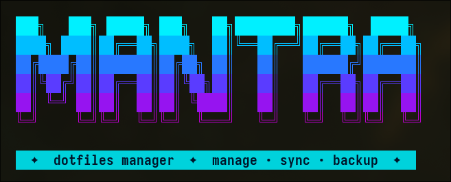

<div align="center">



# mantra

**Dotfiles manager built on a bare git repository.**
No external dependencies. Single static binary. Works anywhere git does.

[](https://golang.org)
[](LICENSE)
[](https://github.com)

</div>

---

## 📦 Requirements

- **Go** 1.21+
- **Git**

---

## 🔨 Build

```bash
go build -ldflags="-s -w" -o mantra .
```

### With Task

Requires [Task](https://taskfile.dev).

```bash
task build          # Linux amd64
task build-cross    # all platforms
task install        # build + copy to ~/.local/bin
task clean          # remove built binaries
```

### Manual cross-compilation

```bash
# macOS Apple Silicon
GOOS=darwin GOARCH=arm64 go build -ldflags="-s -w" -o mantra-darwin-arm64 .

# macOS Intel
GOOS=darwin GOARCH=amd64 go build -ldflags="-s -w" -o mantra-darwin-amd64 .

# Linux amd64
GOOS=linux GOARCH=amd64 go build -ldflags="-s -w" -o mantra-linux-amd64 .
```

---

## 🚀 Installation

```bash
cp mantra ~/.local/bin/mantra
```

Make sure `~/.local/bin` is in your `$PATH`.

---

## ⚙️ Configuration

Config is read from `$XDG_CONFIG_HOME/mantra/config` (default: `~/.config/mantra/config`).
Created automatically with defaults on first run.

```ini
# ~/.config/mantra/config
git-dir=~/.mantra.git
work-tree=~
```

| Key | Default | Description |
|---|---|---|
| `git-dir` | `~/.mantra.git` | Path to the bare repository |
| `work-tree` | `~` | Root directory of dotfiles |

---

## 🛠️ Initial Setup

### New repository

```bash
mantra init
```

Then add a remote:

```bash
git --git-dir=~/.mantra.git remote add origin <url>
```

### Existing repository

```bash
git clone --bare <url> ~/.mantra.git
```

Create the config file and use normally.

### Suppress untracked file noise

With `work-tree=$HOME`, git shows every file in your home directory as untracked. Recommended fix:

```gitignore
# ~/.gitignore
*
```

Then explicitly track files you want:

```bash
mantra add -f ~/.bashrc
mantra add -f ~/.config/nvim/init.lua
```

---

## 💻 Usage

```bash
mantra [command] [args]
```

Running **without arguments** launches the interactive REPL.

### ✨ Interactive Mode (REPL)

```bash
mantra
```

Opens an interactive shell with a live-updating prompt:

```
mantra  main ↑1 +2 ~1 ›
```

**Tab completion** is supported for all commands and subcommands.
Exit with `q`, `exit`, `quit`, `ESC`, or `Ctrl-D`.

#### Prompt indicators

| Symbol | Meaning |
|:---:|---|
| `↑N` | N commits ahead of remote |
| `↓N` | N commits behind remote |
| `!N` | N conflicted files |
| `+N` | N staged files |
| `~N` | N modified files |
| `?N` | N untracked files |

---

### 📋 Basic Commands

| Command | Description |
|---|---|
| `status` | Show working tree status |
| `diff [file]` | Show changes |
| `add [files]` | Stage files (interactive prompt if omitted) |
| `commit [-m msg]` | Commit staged changes (interactive prompt if `-m` omitted) |
| `push` | Push to remote |
| `pull` | Pull from remote |
| `log` | Show commit log (oneline graph) |
| `ls` / `files` | List all tracked files |
| `init` | Initialize the bare mantra repository |
| `help` | Show help |

---

### 🔀 Conflict & History Management

| Command | Description |
|---|---|
| `conflict` | Guided conflict resolution flow |
| `stash [msg]` | Stash working changes (interactive prompt if omitted) |
| `stash pop` | Apply last stash |
| `stash list` | List stashes |
| `rebase <branch>` | Rebase onto branch (interactive prompt if omitted) |
| `rebase --continue` | Continue rebase after resolving conflicts |
| `rebase --abort` | Abort rebase |
| `reset` | Reset HEAD with interactive mode selector |
| `checkout <ref>` | Checkout branch or file (interactive prompt if omitted) |

---

### ⚡ Conflict Resolution Flow

```bash
mantra conflict
```

For each conflicted file the diff is shown and an action is requested:

| Option | Behavior |
|---|---|
| `edit` | Open `$EDITOR` to resolve manually |
| `ours` | Keep the local version |
| `theirs` | Keep the remote version |
| `skip` | Skip the file (leaves it conflicted) |

Once all conflicts are resolved, offers to commit immediately.

---

### 🔄 Interactive Reset

```bash
mantra reset
```

Without arguments, presents a selection menu:

| Option | Behavior |
|---|---|
| `--soft HEAD~1` | Keep changes staged |
| `--mixed HEAD~1` | Keep changes unstaged |
| `--hard HEAD~1` | Discard changes *(asks for confirmation)* |
| `custom` | Manually enter mode and ref |
